Table of Contents

* [Overview](#overview)

* [Introduction](#intro)

* [Launching a development toolchain using AWS CodeStar](#devtool)

* [Writing your first AWS Lambda Function on AWS Cloud9](#cloud9)

* [Deploying Your Function using AWS SAM and AWS CodeDeploy](#sam)

* [Debugging and Monitoring your function](#debugging-and-monitoring-your-function)

* [Clean up](#cleanup)

* [Conclusion](#conclusion)

<a name="overview"></a>
# 1. Overview

<a href="https://www.youtube.com/watch?v=Hv3YrP8G4ag" target="_blank">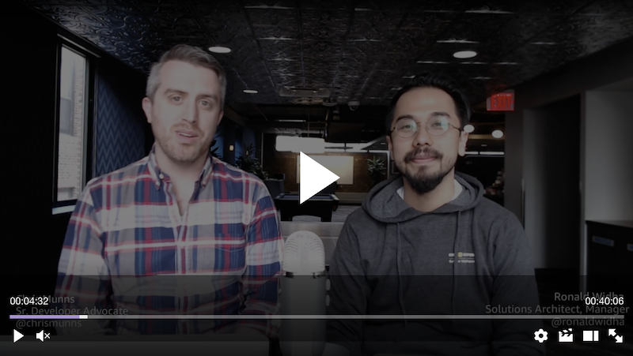</a>
<br />
Follow along this workshop on <a href="https://www.youtube.com/watch?v=Hv3YrP8G4ag" target="_blank">Youtube</a>.

With services like AWS CodeStar, AWS Cloud9, AWS Lambda and Amazon API Gateway, developers can very easily develop, debug, and deploy serverless applications in the cloud.

AWS CodeStar enables you to quickly develop, build, and deploy applications on AWS. AWS CodeStar provides a unified user interface, enabling you to easily manage your software development activities in one place. With AWS CodeStar, you can set up your entire continuous delivery toolchain in minutes, allowing you to start releasing code faster.

AWS Cloud9 is a cloud-based integrated development environment (IDE) that lets you write, run, and debug your code with just a browser. It includes a code editor, debugger, and terminal. With Cloud9, you can quickly share your development environment with your team, allowing you to pair program and track each other&#39;s inputs in real-time.

AWS Lambda lets you run code without provisioning or managing servers. You pay only for the compute time you consume - there is no charge when your code is not running. With Lambda, you can run code for virtually any type of application or backend service - all with zero administration. Just upload your code and Lambda takes care of everything required to run and scale your code with high availability.

In this Lab, you will experience:

- Launching development tools for building a serverless application using AWS CodeStar.
- Developing your first AWS Lambda function.
- Deploying your first AWS Lambda function using AWS SAM (Serverless Application Model).
- Testing and debugging your AWS Lambda function in AWS Cloud9 and AWS SAM Local.

**Important:** Many of the steps in this lab involve resolving errors that have been built in to the provided starter files (in step 17). This approach will show how the IDE can be used to develop, test and deploy serverless applications.

<a name="intro"></a>
# 2. Introduction

In this hands-on lab, we are going to start with a Hello World node.js serverless app that returns a static web page. As part of this lab, we will be developing, testing, debugging and deploying a new serverless function for adding 2 numbers. The high level architecture is as follows:

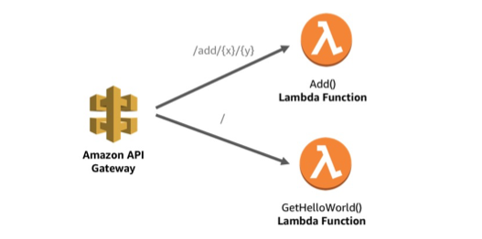

<a name="devtool"></a>
# 3. Launching a development toolchain using AWS CodeStar

1. Sign into the AWS Management Console [https://console.aws.amazon.com/](https://console.aws.amazon.com/).

**Note:** For this lab you will need to use an IAM user and not a federated user account. The account will require _AWSCodeStarFullAccess_ managed policy. Alternatively, you can create projects if you have an IAM administrative user with full permissions for all AWS Services (_AdministratorAccess_ managed policy). For more information, see [Setting up AWS Code Star (Step 3: Create or Use an IAM User).](https://docs.aws.amazon.com/codestar/latest/userguide/setting-up.html#setting-up-create-iam-user)

2. In the upper-right corner of the AWS Management Console, confirm you are in the desired AWS region (e.g., N. Virginia).
3. Click on **AWS CodeStar** from the list of all services.
4. Click on **Start a project**.
5. If this is the first time you use the service, you will be prompted to create the required service roles for AWS Code \* services. Select **Yes, create role**.

6. Choose a project template:
Under _Application Category_ select _Web Application._
Under _Programming Languages_ select _Node.js._
Pick _Node.JS Web Application AWS Lambda (running serverless)._

 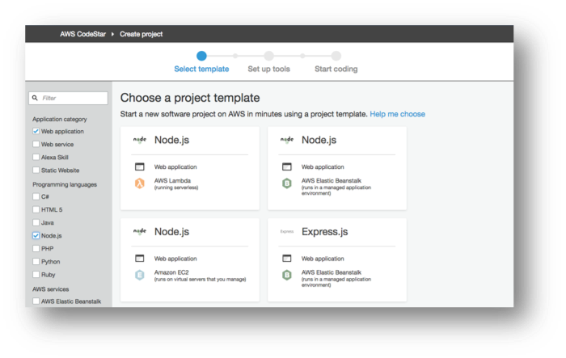

7. Enter the project details:

Project name: _serverless-lab._

Which repository do you want to use? _AWS CodeCommit._

Click **Next**.

 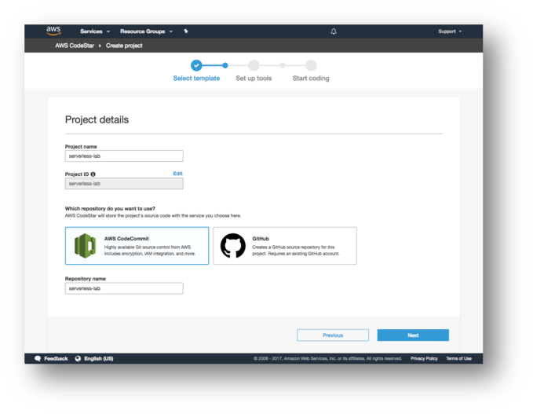

8. Leave everything as the default and click on **Create Project**. If this is the first time you use the service, you will also be prompted to enter your display name and email.
9. We are going to use AWS Cloud9 as our IDE. Select AWS Cloud9 and hit **Next.**

10. For our instance, we will select _t2.micro_. We will leave the networking settings as default which will launch the instance in our default VPC in a public subnet. Under _Cost-saving_ settings, observe that the environment will be automatically shut down after 30 minutes. Click **Next**.

11. AWS CodeStar is now provisioning all the AWS Code \* services. This process may take around 3-5 minutes.

  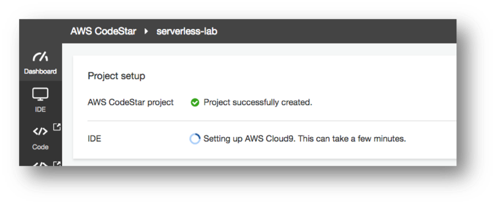

12. While you wait, open up a new browser tab and go to the [IAM Roles console](https://console.aws.amazon.com/iam/home?region=us-east-1#/roles) (listed under Services). Search for 'code' and notice that AWS CodeStar created new IAM Roles for each of the AWS service we are going to use.

 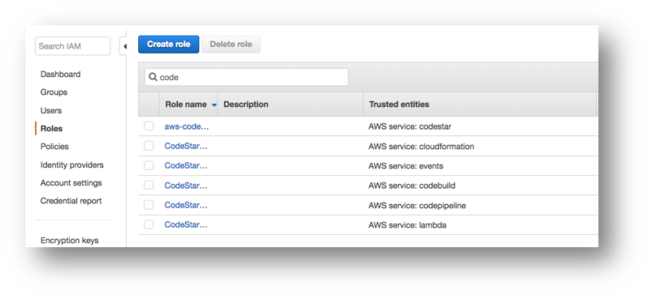 

13. Head back to the _AWS CodeStar Dashboard_ and scroll to the _Application endpoints_ panel.

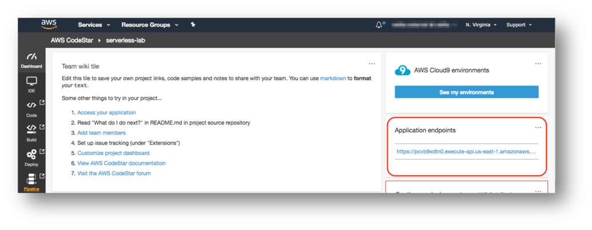
 
14. Click on the endpoint URL. You should see a &quot;Hello World&quot; web page rendered by Node.js. Congratulations! You successfully configured an end-to-end development and continuous deployment pipeline on AWS.

<a name="cloud9"></a>
# 4. Writing your first AWS Lambda Function on AWS Cloud9

15. Go back to the AWS CodeStar dashboard, and click on **IDE** on the left pane.
Click **Open IDE.**

 
 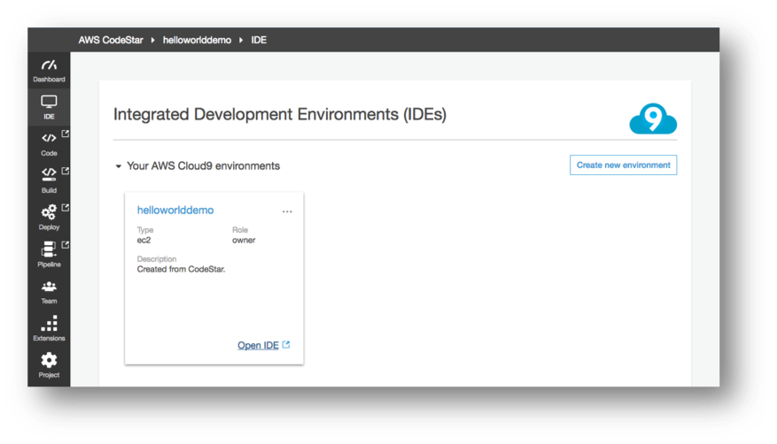
 
 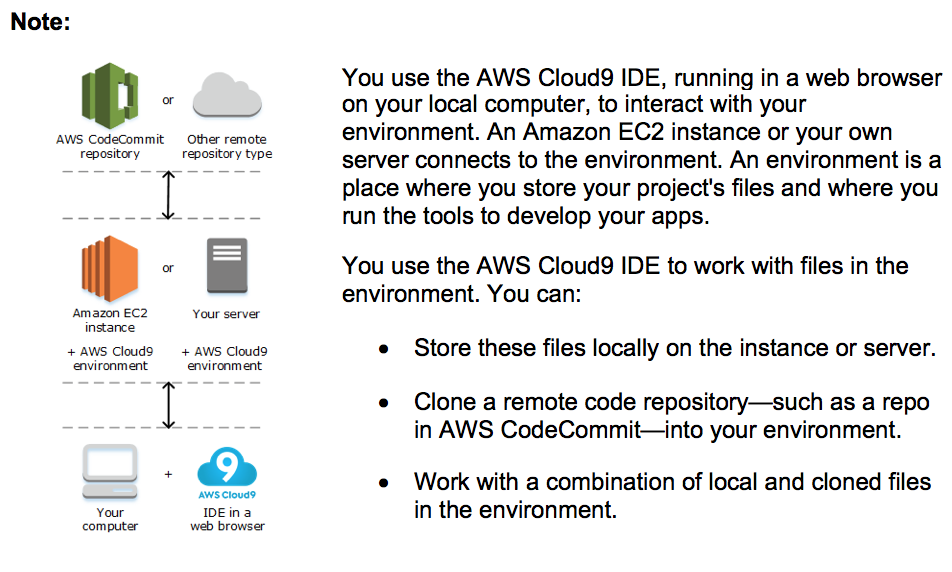


16. Upon first login, AWS Cloud9 automatically clone a starter project "locally" into our development instance. You should see something like this:


```
user:~/environment $ /tmp/git-cloning-runner-xxx-xxx.sh
Cloning into '/home/ec2-user/environment/serverless-lab'...
remote: Counting objects: 16, done.
Unpacking objects: 100% (16/16), done.

Navigate to your cloned repository by typing "cd /home/ec2-user/environment/serverless-lab" to start working with "https://git-codecommit.us-east-1.amazonaws.com/v1/repos/serverless-lab"

To set your display name run "git config --global user.name YOUR_USER_NAME"
To set your display email run "git config --global user.email YOUR_EMAIL_ADDRESS"

user:~/environment $
```

17. We are going to create a new API microservice in this project. Perform the following command in the terminal window at the bottom (labeled as bash - "ip-xx-xx-xx-xx")

```
cd serverless-lab
wget https://s3-us-west-2.amazonaws.com/apn-bootcamps/serverless-2018/addservice-01.tar.gz
tar xzf addservice-01.tar.gz
rm addservice-01.tar.gz
```

**Note:** In some browsers (E.g. Google Chrome), you may be prompted to download Cloud9 Browser Extension to enable copy-paste between this document, and the AWS Cloud9 IDE inside the browser window.

 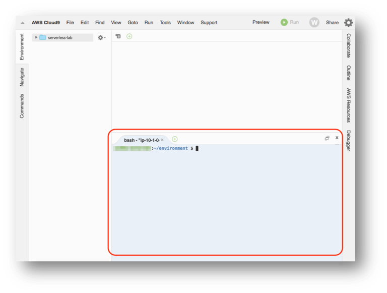 

The commands above will add the following files to your local AWS Cloud9 environment: 

* `add.js` - our addition-as-a-service lambda function
* `test/event.numbers.json` - the test payload
* `.gitignore` - instruction for git to ignore temp files
 
 
To confirm we have all the files in place, perform ls in the terminal window and you should see the following files:


*	`add.js`
*	`buildspec.yml`
*	`index.js`
*	`\nothing`
* `\public`
*	`README.md`
*	`template.yml`
*	`\test`
*	`\tests`


18. We will need to update our SAM template (`template.yml`) to register our new function.
Incorporate these **requirements** by modifying the `template.yml` file:


* Function name: `AddService`
* The functionality will be handled by the `handler()` function in `add.js`
* Runtime: `nodejs6.10`
* Use the same `LambdaTrustRole`
* The event trigger will be coming from our existing `GetEvent` API Gateway
* We would like to return a JSON response whenever we receive an `ANY` HTTP request to the API with path `/add/{x}/{y}`. Therefore, given `http://[api-address]/add/1/2`, the API should return `{ … "result":3 … }`.  


**Hint:** Use the _GetHelloWorld_ resource definition in the same file (template.yml) to help you apply the necessary changes.  See [Serverless Resources Within AWS SAM](http://docs.aws.amazon.com/lambda/latest/dg/serverless_app.html) for the complete reference, or use the guide below:

```
AddService:
  Type: AWS::Serverless::Function
  Properties:
    Handler: filename.handler-function
    Runtime: nodejs6.10
    Role:
      Fn::ImportValue:
        !Join ['-', [!Ref 'ProjectId', !Ref 'AWS::Region', 'LambdaTrustRole']]
    Events:
      GetEvent:
        Type: Api
        Properties:
          Path: /path/{x}/{y}
          Method: any
```
**HINT** Make sure to update the Handler and Path values with the AddService details.

19. After you are done making those changes. Let's test our resource definition locally in our Cloud9 environment to make sure we have defined our new AWS Lambda function correctly. In the terminal window, confirm that you are in
`/home/ec2-user/environment/serverless-lab/` and perform the following:

```
sam local invoke "AddService" -e test/event.numbers.json
```

Our add.js currently does not implement the functionality we are seeking. We are expecting to see `Error: Not Implemented` exception. This means we have configured our SAM template correctly.

**Note:** The first time you execute a function, SAM LOCAL will fetch the appropriate Docker image for the function as defined in our template.yml. Once that is done, SAM LOCAL will invoke the Lambda function we just wrote, show the response, _Duration_ and the _Max Memory Used_ metric which is useful for tuning our AWS Lambda function configuration.

20. Open up _add.js_ and implement our add function in line 12-16.


 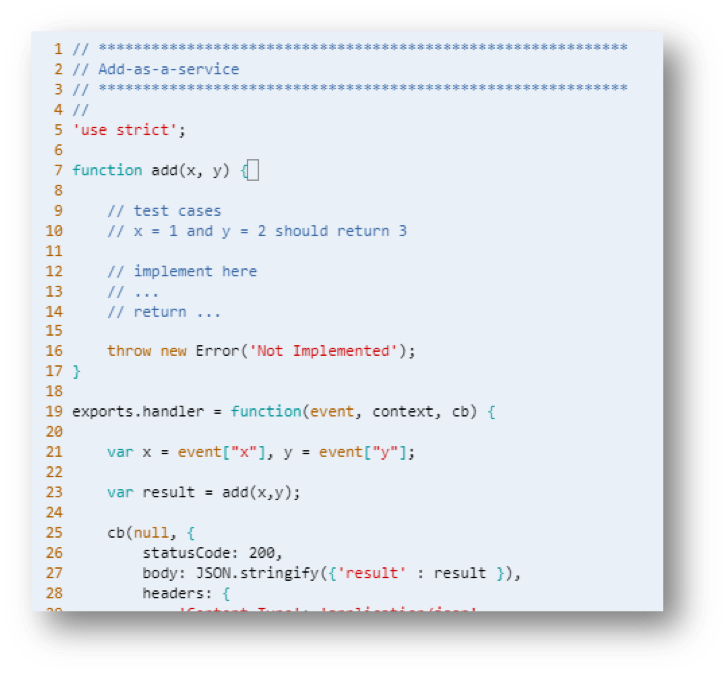 


21. You think you got it right? Let's test out the Lambda function locally again:

```
sam local invoke "AddService" -e test/event.numbers.json
```

should return the following:

```
{
    "statusCode":200,
    "body":"{\"result\":116}",
    "headers":{"Content-Type":"application/json, … }
}
```

22. Congratulations! You have implemented add()as an AWS Lambda function.

<a name="sam"></a>
# 5. Deploying Your Function using AWS SAM and AWS CodeDeploy

23. We will now configure our git user in the AWS Cloud9 environment so we can commit our changes to the code repository

```
git config --global user.email you@example.com
git config --global user.name "Your Name"
git config credential.helper store
```

24. We are going to add all our pending changes, commit it to Git and push it to our AWS CodeCommit Repository:

```
git add -A
git commit -m "add add-as-a-service"
git push origin master

```


25. By default, AWS CodeStar configured AWS CodeBuild to deploy on every code commits. Go back to your AWS CodeStar serverless-lab dashboard. You can see the status of the current build, or see more details about the build by selecting **Build** from the left hand pane. You will notice that a build is currently taking place. This will take around 2 minutes.

 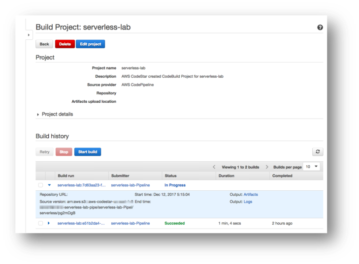 

**Note:** You can also deploy the AWS Lambda function manually, by executing the following commands. You will need to provide S3 bucket location, CloudFormation Stack name and other parameters that the CloudFormation requires.

To create the package on an S3 Bucket:

```
aws cloudformation package \
    --template-file ./template.yml \
    --s3-bucket $S3_BUCKET \
    --s3-prefix $S3_BUCKET_PREFIX_NAME \
    --output-template-file ./template.output.yml \
    --force-upload 
```


To execute the deployment:

```
aws cloudformation deploy \
    --template-file ./template.output.yml \
    --stack-name $STACK_NAME \ # E.g. serverless-lab
    --capabilities CAPABILITY_IAM
    --parameter-overrides ProjectId=$PROJECT_ID # E.g. serverless-lab
```


<a name="debugging"></a>
# 6. Debugging and Monitoring your function

26. After a successful deployment, open the AWS CodeStar project dashboard and copy our _Application endpoints_ location.

 
 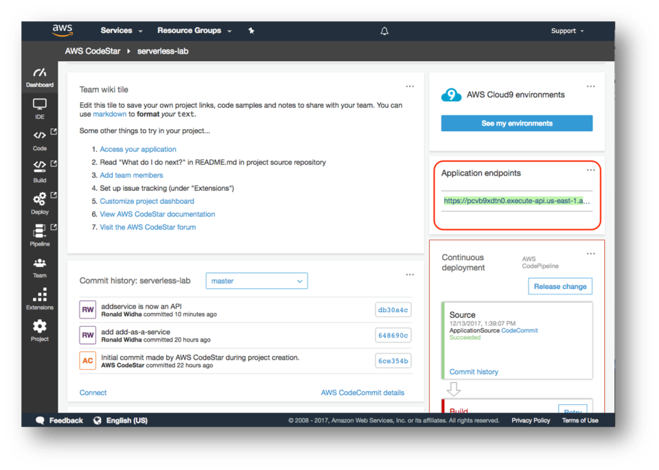

27. Open up a browser and modify the URL to look something like this:
 [https://xxxx.execute-api.us-east-1.amazonaws.com/Prod/add/2/3](https://xxxx.execute-api.us-east-1.amazonaws.com/Prod/add/2/3)
 
  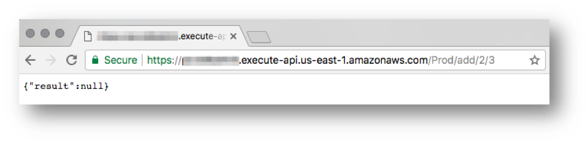
  
Oh no! It looks like we have a bug. On step 19, we tested the Lambda function `add.js` in isolation and it performed correctly. However we have not tested the function integrated with the Amazon API Gateway. Head back to our AWS Cloud9 IDE so we can debug this issue.

28. Open add.js and add a breakpoint on line 17 by clicking on the space next to the row number until it is showing a red dot. Click **Run** to start our debugging session.

  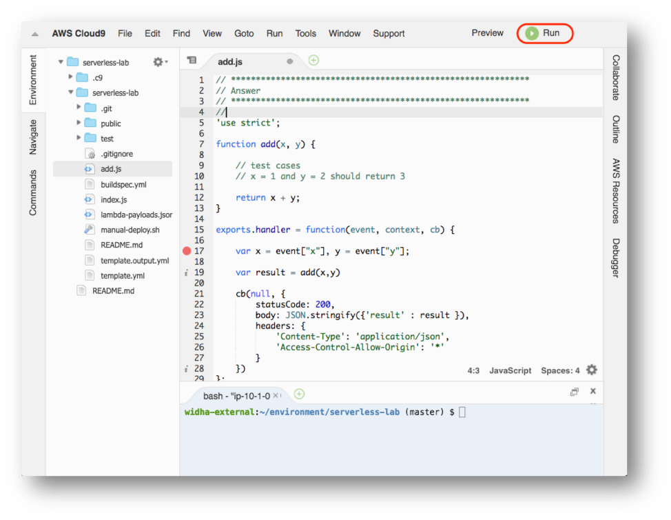

29. Since the bug only appears when the function is called by Amazon API Gateway, we will debug our function using a local API Gateway environment. Enter the following configuration:

* Click on the Debug icon

* Run on: API Gateway (local)

* Function: AddService

* Path: /add/1/2

* Method: GET

* Click **Run**


 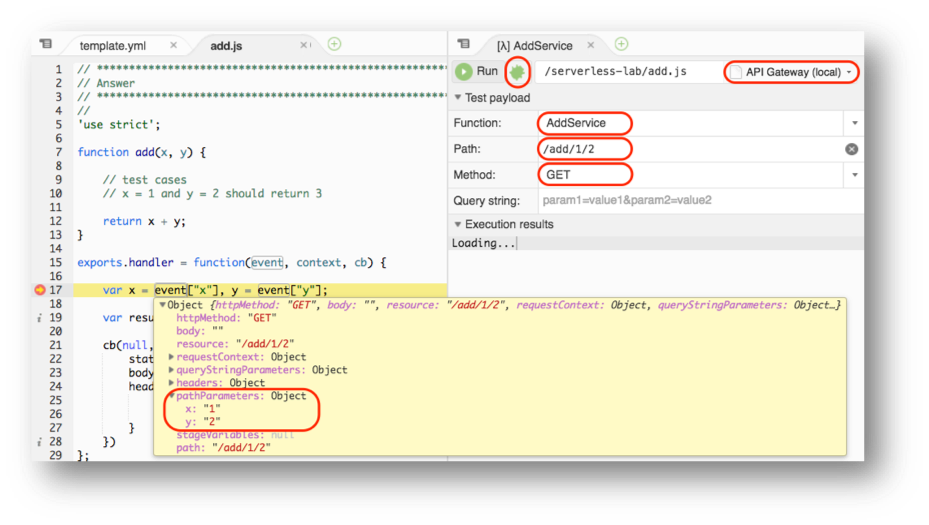 
 

30. We should now see the debugger stops at line 17. Observing it closely, we need to make adjustment to line 17 to read from the correct event object properties. Make those changes.

**Hint:** Watch out for the [data types](https://developer.mozilla.org/en-US/docs/Web/JavaScript/Reference/Global_Objects/Number#Examples).

31. Let's test it again using the command line this time:

```
sam local start-api
```

Press enter.  This will start a process that runs and monitors the api endpoint.  Open a new terminal from the bottom `Console` window, and run the following command:

```
curl http://127.0.0.1:3000/add/25/75
```

We should now receive the right result `{ … "result":100 … }` (Note that the output may be formatted to appear before the terminal prompt)

32. Commit our latest changes to AWS CodeCommit again.

```
git add -A
git commit -m "Bugfix: Add() now performs correctly on API GW"
git push origin master
```

33.	Wait for our Continuous Deployment pipeline to complete, and test it from our live endpoint that looks similar to: https://xxxx.execute-api.us-east-1.amazonaws.com/Prod/add/25/75  

## Adding AWS X-Ray to your Lambda Function

34.	Go to project dashboard and click Project on the left menu. We need to add X-Ray permission to the lambda execution policy. Click CodeStarWorker-serverless-lab-Lambda role and add the following x-ray FullAccess to the policy.

```
        {
            "Sid": "2",
            "Effect": "Allow",
            "Action": [
                "apigateway:GET",
                "logs:DescribeLogGroups",
                "xray:*"
            ],
            "Resource": [
                "*"
            ]
        }
```
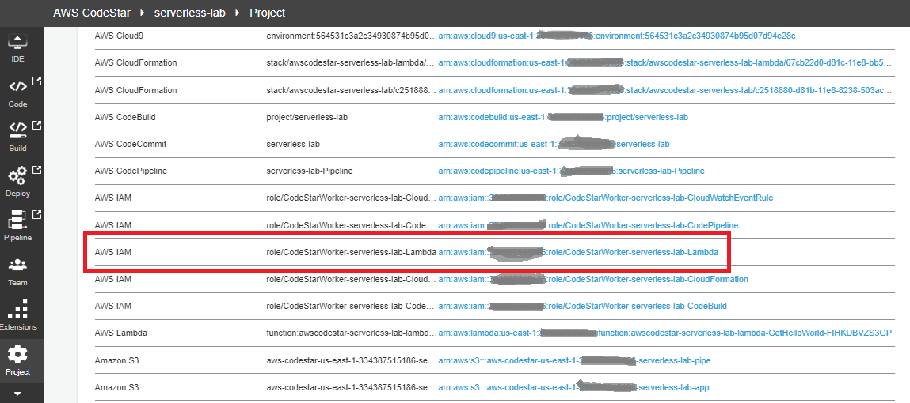 

35.	Enable AWS X-Ray for your Lambda function by updating template.yml with Properties, Tracing: Active. Save and commit the changes.

```
  AddService:
    Type: AWS::Serverless::Function
    Properties:
      Handler: add.handler
      Runtime: nodejs6.10
      Tracing: Active
      Role:
        Fn::ImportValue:
          !Join ['-', [!Ref 'ProjectId', !Ref 'AWS::Region', 'LambdaTrustRole']]
      Events:
        GetEvent:
          Type: Api
          Properties:
            Path: /path/{x}/{y}
            Method: any
```            

36.	Go to the Project Dashboard and observe the project as it goes through CodePipeline. Once completed, go to the Lambda Function and observe that Tracing is enabled. 

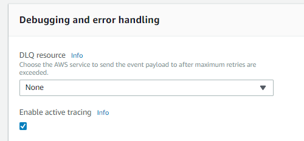 

37.	Go to the API Gateway console to enable X-Ray Tracing. Select API Gateway for this project then select Stage. For both Prod and Staging, enable X-Ray Tracing.

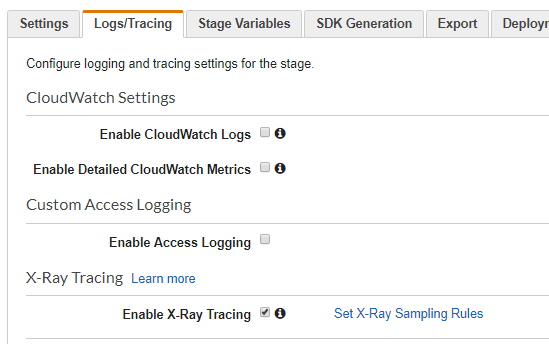

38. Go back to CodeStar Project dasboard and click EndPoint link to access WebAPP. Ensure to modify the endpoint to perform Rest API call.

https://xxxx.execute-api.us-east-1.amazonaws.com/Prod/add/25/75 

39. Go to X-Ray console and observer Service Map and Traces.

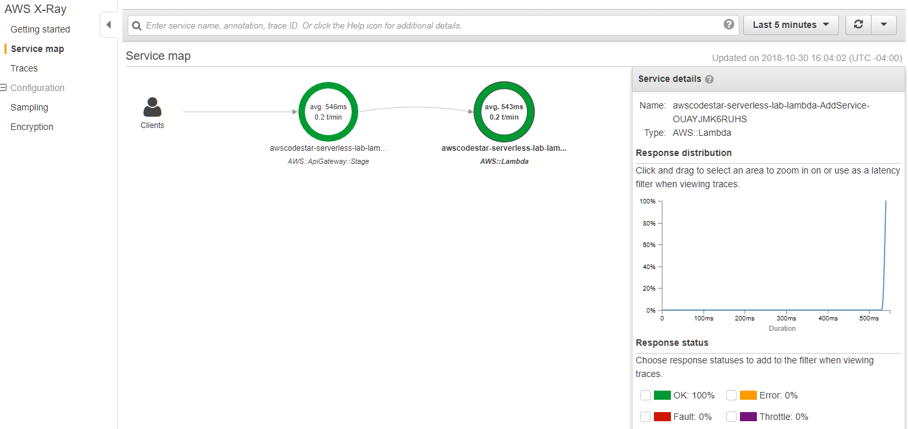

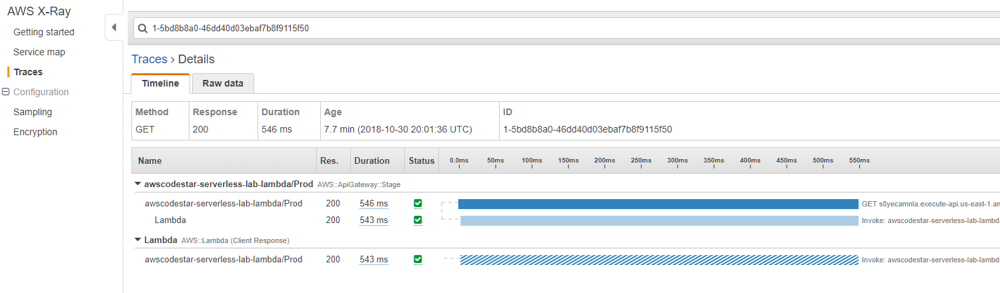

40. Congratulations, you have completed the lab.

<a name="cleanup"></a>
# 7. Clean up

After you are done with your lab, head over to the CloudFormation console (listed under Services) and delete `aws-cloud9-serverless-lab-xxxxxx`, `awscodestar-serverless-lab-lambda`, and `awscodestar-server-lab` stacks. This will delete all the resources we created during this lab.

<a name="conclusion"></a>
# 8. Conclusion

In this lab you have learned creating end-to-end development tools using AWS CloudStar, writing your first Serverless microservice using AWS Lambda and Amazon API Gateway using the AWS Cloud9 IDE.
