- [Overview](Instructions.md#overview)

- [Application Architecture](Instructions.md#application-architecture)

- [Learning Objectives](Instructions.md#learning-objectives-of-the-workshop)

- [Setup Twitter Application](Instructions.md#1-set-up-twitter-application)

- [Create EC2 Key Pair](Instructions.md#2-create-a-new-ec2-key-pair)

- [Launch the Stack](Instructions.md#3-launch-the-stack)

- [Confirm your email address for SNS subscription](Instructions.md#4-confirm-your-email-address-for-sns-subscription)

- [Start the application to receive Twitter streaming data](Instructions.md#5-start-the-application-to-receive-twitter-streaming-data)

- [Tweet and review incoming Twitter metadata](Instructions.md#6-tweet-and-review-incoming-twitter-metadata)

- [Review images extracted from Tweets](Instructions.md#7-review-images-extracted-from-tweets)

- [Upload reference image for favorite celebrity](Instructions.md#8-upload-reference-image-for-favorite-celebrity)

- [Setup Cloud9 IDE](Instructions.md#9-setup-cloud9-ide)

- [Code to compare incoming images with reference image](Instructions.md#10-code-to-compare-incoming-images-with-the-reference-image-exercise)

- [Validate face comparison](Instructions.md#11-validate-face-comparison)

- [Clean up](Instructions.md#clean-up)

## Overview

 
Follow along this workshop on <a href="https://www.youtube.com/watch?v=ohXgbcbYH7U" target="_blank">YouTube</a>.

In this workshop, we will build a solution that listens to Twitter feed and capture images from that feed. It then compares those images against the reference image of your favorite celebrity and notifies you about the latest post about your favorite celebrity.

In this workshop, we will use following AWS services:

- [AWS Cloud9](https://aws.amazon.com/cloud9/) is a cloud-based integrated development environment (IDE) that lets you write, run, and debug your code with just a browser. It includes a code editor, debugger, and terminal.
- [AWS Lambda](https://aws.amazon.com/lambda/) lets you run code without provisioning or managing servers. You pay only for the compute time you consume - there is no charge when your code is not running.
- [Amazon Kinesis Data Firehose](https://aws.amazon.com/kinesis/) is the easiest way to capture, transform, and load data streams into AWS data stores for near real-time analytics with existing business intelligence tools.
- [Amazon S3](https://aws.amazon.com/s3/) is object storage built to store and retrieve any amount of data from anywhere – web sites and mobile apps, corporate applications, and data from IoT sensors or devices.
- [Amazon DynamoDB](https://aws.amazon.com/dynamodb/) is a fast and flexible NoSQL database service for all applications that need consistent, single-digit millisecond latency at any scale. It is a fully managed cloud database and supports both document and key-value store models.
- [Amazon Rekognition](https://aws.amazon.com/rekognition/) is Deep learning-based image and video analysis service. which makes it easy to add image and video analysis to your applications.
- [Amazon SNS](https://aws.amazon.com/sns/) is a flexible, fully managed pub/sub messaging and mobile notifications service for coordinating the delivery of messages to subscribing endpoints and clients.
- [Amazon EC2](https://aws.amazon.com/ec2/) is a web service that provides secure, resizable compute capacity in the cloud. It is designed to make web-scale cloud computing easier for developers.
- [Amazon CloudFormation](https://aws.amazon.com/cloudformation/) provides a common language for you to describe and provision all the infrastructure resources in your cloud environment.

## Application architecture

Architectural diagram below shows the workflow where:

- Python code running on EC2 instance listens to Twitter feed and push the metadata to Amazon Kinesis Firehose.
- Firehose then writes incoming metadata to an S3 bucket.
- As metadata is written to S3, it triggers a Lambda function, which reviews incoming metadata and download the image that is part of the tweet. It also stores metadata about the image in a DynamoDB table.
- As image from the tweet gets stored on S3 bucket, it triggers another Lambda function which then compares reference image with the image from the tweet.
- If incoming image from the tweet matches with the reference image, Lambda function then gets additional image metadata from DynamoDB table and uses SNS to send a notification about possible match.

## Learning objectives of the workshop

In this workshop you will learn the following:
- Creating infrastructure including S3 bucket, Lambda functions, DynamoDB and SNS topic using Amazon CloudFormation.
- Developing Lambda function to process incoming data from Firehose and persist it in DynamoDB.
- Developing Lambda function to compare faces using Amazon Rekognition and send notification using Amazon SNS.

## 1. Set up Twitter application

- Go to <https://apps.twitter.com>

     

- Login if you have an account, otherwise sign up for a new account. Note you will need your mobile number included in your account profile to build Twitter apps.

     

- Select Create New App

     

- Provide a unique name such as YOUR-INITIALS-FindCelebrityRekognitions

     

- Next you will get the details from your new app. Key data points to collect are consumer key/api highlighted by the red arrow below.

     

- Click on the Key & Access tokens

     

- To generate tokens -- click on the create my access token then capture the details such as shown in the screen below

     

- Capture your API Key & Secret and Access Token and Secret for later use in Notepad or text editor

## 2. Create a new EC2 key pair

For this workshop, you will need to create an EC2 instance using an SSH keypair in the Ireland region (eu-west-1). If you already have a SSH key pair in Ireland region please skip this section and go onto the next step.

The following steps outline creating a unique SSH keypair for you to use in this workshop.

- Sign into the AWS Management Console and open the Amazon EC2 console at <https://console.aws.amazon.com/ec2>

- In the upper-right corner of the AWS Management Console, confirm you are in the Ireland region.

- Click or type EC2 on search line then click on EC2 service from the menu

- Click on Key Pairs in the NETWORK & SECURITY section near the bottom of the leftmost menu. This will display a page to manage your SSH key pairs.

  

- To create a new SSH key pair, click the Create Key Pair button at the top of the browser window

  

- In the resulting pop up window, type \[First Name\]-\[LastName\]-Rekognition into the Key Pair Name: text box and click Create.

  

- The page will download the file *"[Your-Name]-Rekognition.pem"* to the local drive. Follow the browser instructions to save the file to the default download location.

- Remember the full path to the file .pem file you just downloaded. You will use the Key Pair you just created to manage your EC2 instances for the rest of the lab

## 3. Launch the stack

This automated AWS CloudFormation template create various components of the application including EC2 instance, S3 buckets, DynamoDB table and Lambda functions.

- Log in to the **AWS Management Console** and ensure you select the **Ireland** AWS region in the top right region selection.

- [Click here to launch CloudFormation Template ](https://console.aws.amazon.com/cloudformation/home?region=eu-west-1#/stacks/create/review?stackName=celebrityrek&templateURL=https://s3-eu-west-1.amazonaws.com/serverlessbytes/RekognitionWorkshopCFN.json)

- Complete fields on the **Create stack** page.
- Keep Stack name short as Cloudformation template uses this name as prefix to create various resources.

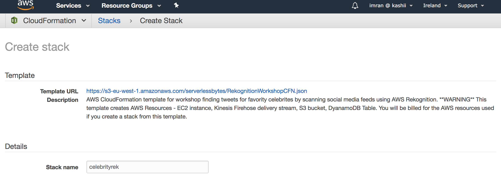
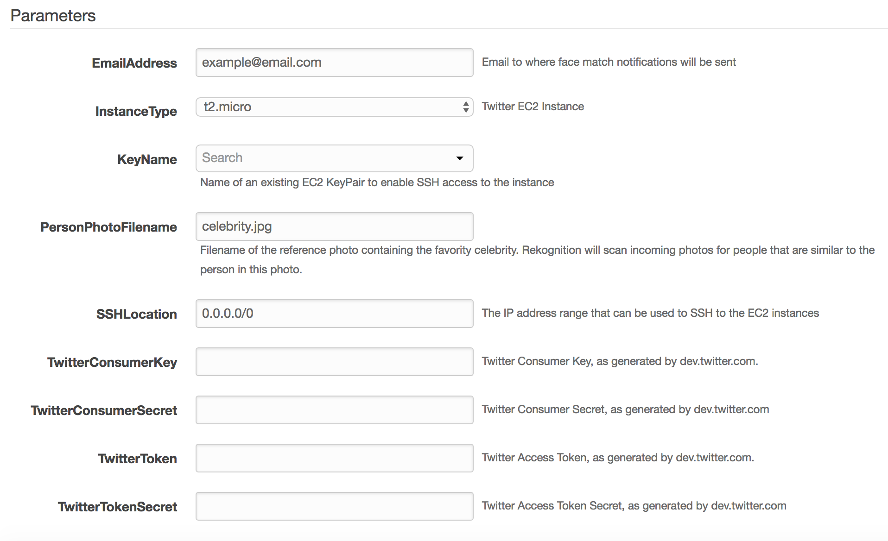
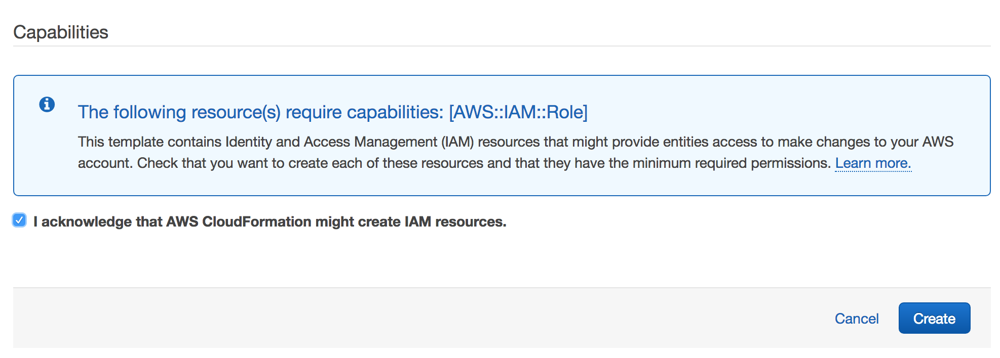

| **Parameter** | **Default** | **Description** |
| --------------| :----------: | :-------------- |
|**StackName**  |  celebrityrek | Name of the Stack to launch **Must all be lowercase letters.**|
| EmailAddress | *Requires input* | Email address to use during workshop so you can receive emails notifications.|
| InstanceType | *t2.Micro* | Select your instance type. Recommend t2.Micro |
| KeyName | *Requires input* | SSH key for Ireland region to use during the workshop. Without this key you will not be able to connect to your instance.|
|PersonPhotoFilename | *celebrity.jpg* | Name of favorite celebrity reference photo to be stored in S3 bucket.|
| SSHLocation | *0.0.0.0/0* | The IP address range that can be used to SSH to the EC2 instances |
| TwitterConsumerKey | *Requires input* | Twitter Consumer Key, as generated by dev.twitter.com. Part of the pre setup steps |
| TwitterConsumerSecret | *Requires input* |Twitter Consumer Secret, as generated by dev.twitter.com Part of the pre setup steps|
| **TwitterToken** | *Requires input* | Twitter Access Token, as generated by dev.twitter.com. Part of the pre setup steps |
| TwitterTokenSecret | *Requires input* | Twitter Access Token Secret, as generated by dev.twitter.com Part of the pre setup steps |

- Verify that you modified the correct parameters.

- Choose **Create** to deploy the stack.

You can view the status of the stack in the AWS CloudFormation console in the Status column. You should see a status of **CREATE\_COMPLETE** in roughly five (5) minutes.

## 4. Confirm your email address for SNS subscription

- As CloudFormation template complete, you will receive a subscription confirmation from **SNS**. Check your email and you must confirm subscription in order for the email alerting feature to work in this workshop.

## 5. Start the application to receive Twitter streaming data

Follow the steps below to run python application on EC2 instance that will start getting Twitter feed and send to Amazon Kinesis Firehose.

- Navigate to the stack **Outputs** tab in the CloudFormation console.

- Note the name of the EC2 Instance and capture the Public IP address

- Open an SSH connection to your instance (if using Windows you will need putty & puttygen to connect)

- Run the following command to set the default region in the EC2 instance CLI to Ireland

 **export AWS\_DEFAULT\_REGION=eu-west-1**

- Go to /home/ec2-user/rekognition-workshop directory and run the python source code to start streaming twitter data.

 [ec2-user@ip-172-31-2-51 rekognition-workshop\]\$ **python twitter\_streaming.py**

## 6. Tweet and review incoming Twitter metadata

- Go to Twitter app and tweet an Image.

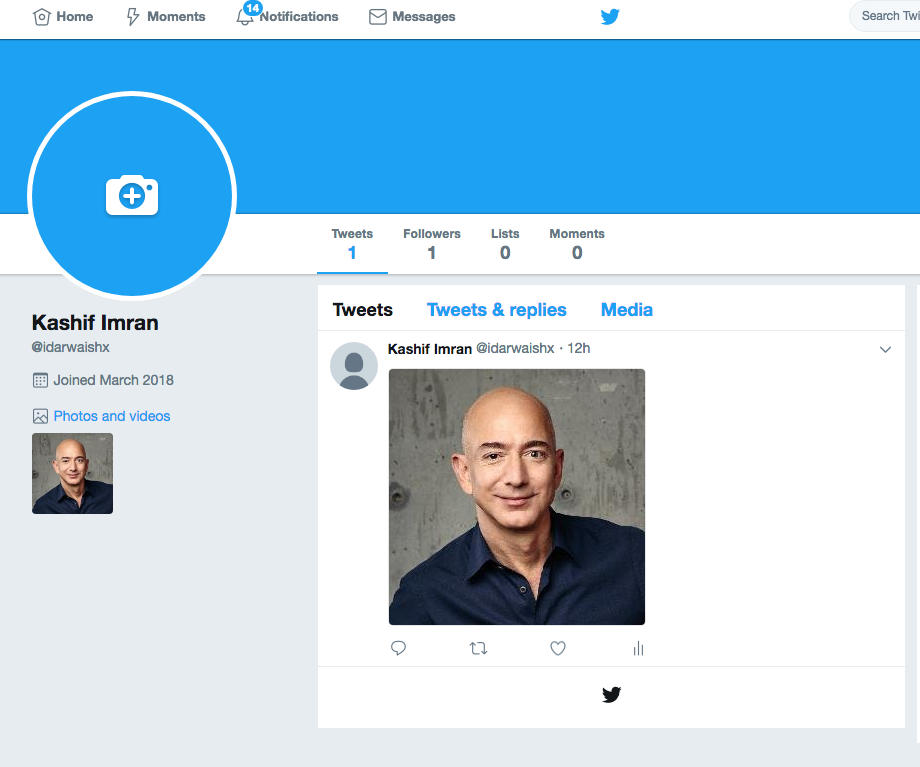

- Navigate to the **S3** console at https://s3.console.aws.amazon.com/s3/home?region=eu-west-1#.

- Select the bucket starting with "celebrityrek-twitter"

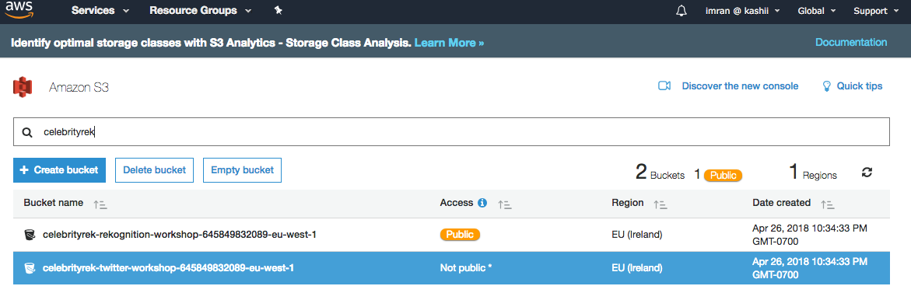

- You should see folder structure created by Amazon Kinesis Firehose and JSON metadata for incoming tweets.

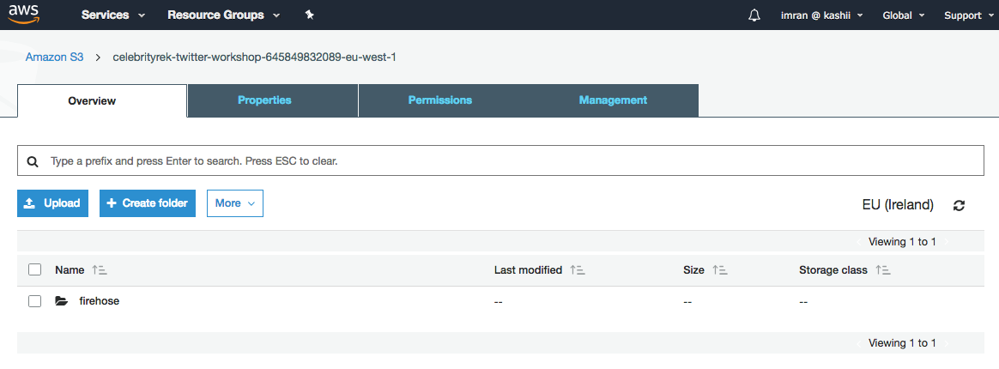

## 7. Review images extracted from Tweets

 - Navigate to the **S3** console at https://s3.console.aws.amazon.com/s3/home?region=eu-west-1#.

 - Select the bucket starting with "celebrityrek-rekognition".

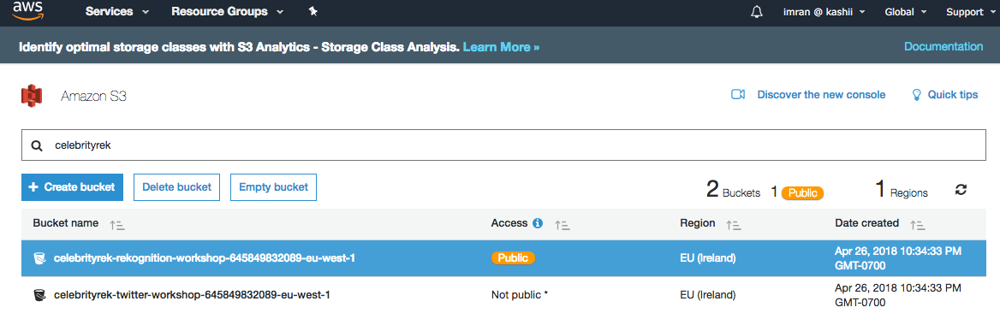

 - Go to images folder in the bucket and you should images extracted from incoming Tweets.

 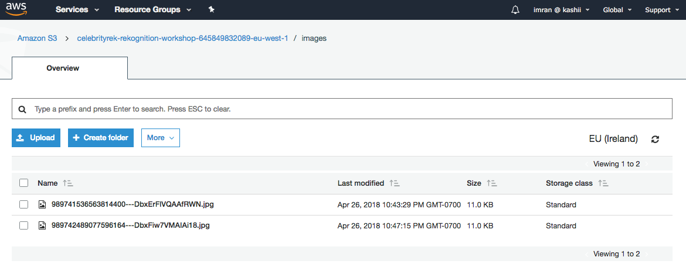

## 8. Upload reference image for favorite celebrity

- Navigate to the **S3** console at https://s3.console.aws.amazon.com/s3/home?region=eu-west-1#.

- Select the bucket starting with "celebrityrek-rekognition".

 - Upload your reference favorite celebrity image to the base folder in this bucket. Ensure the name matches the reference name used when creating the CloudFormation stack.

 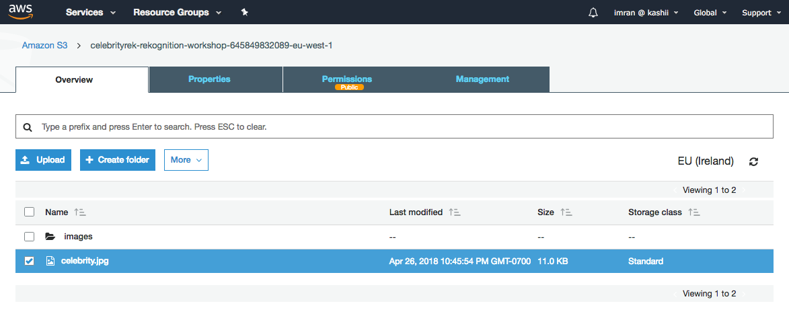

## 9. Setup Cloud9 IDE

- Go to Cloud9 in AWS Console at https://eu-west-1.console.aws.amazon.com/cloud9/home?region=eu-west-1# and click on Create environment.

- Enter a name and description and click on Next step.

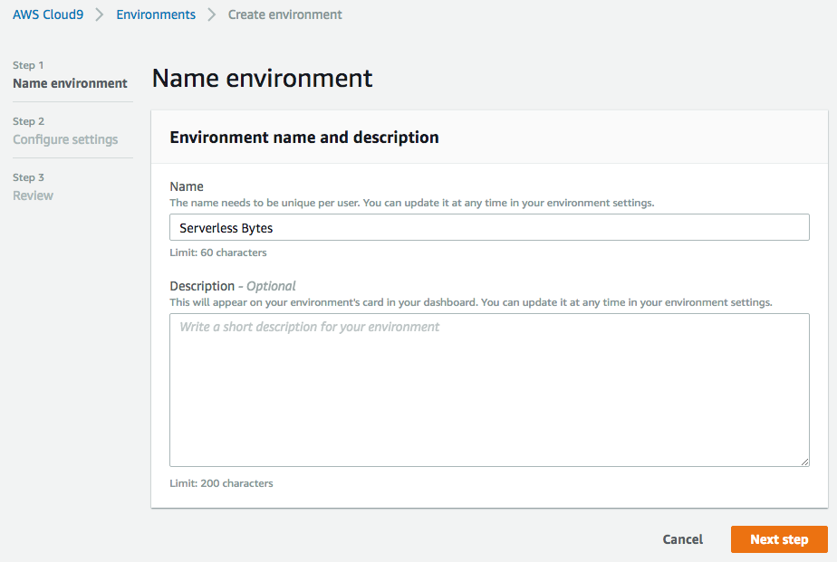

- Leave default options on the configure settings screen and click Next step.

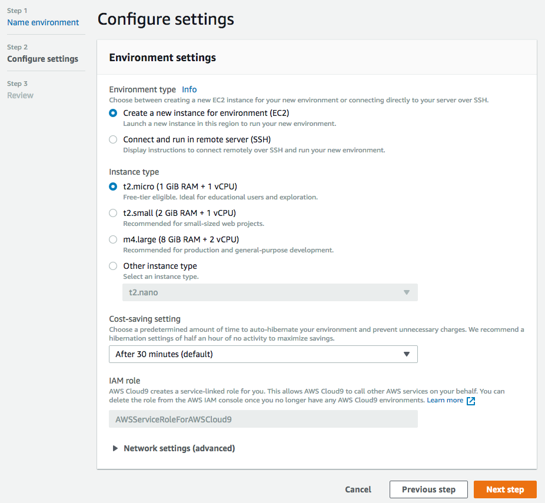

- On the Review screen, review all the settings and click Create environment.

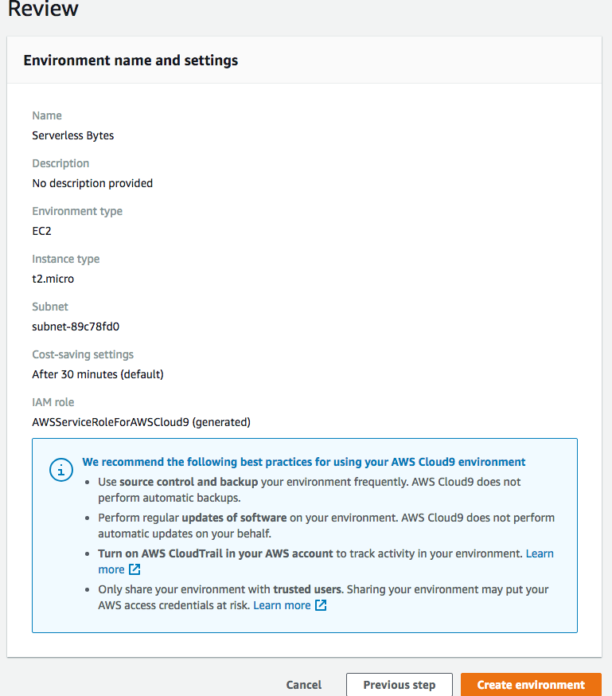

- In few seconds you will be redirected to your Cloud9 IDE in the browser.

## 10. Code to compare incoming images with the reference image (Exercise)

- In your Cloud9 IDE, click on AWS Resources and import Lambda function starting with "celebrityrek-Rekognition".

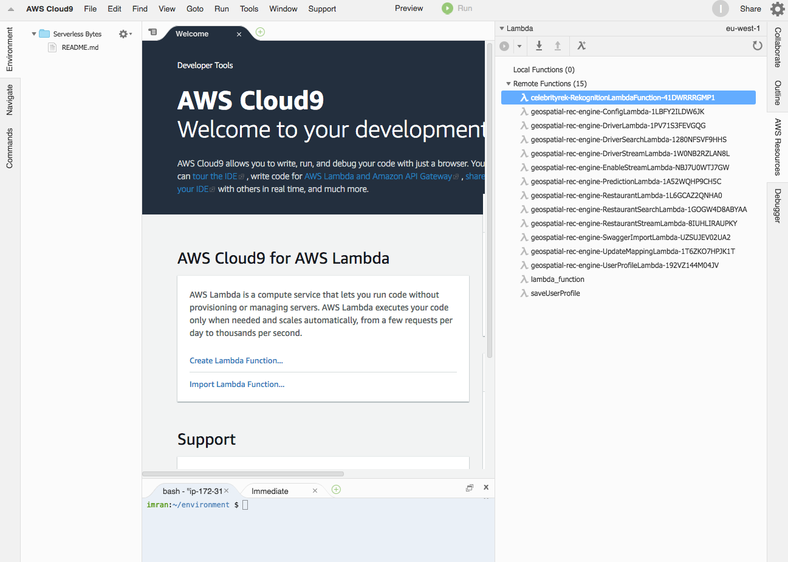

- This Lambda function was created using CloudFormation stack and will be invoked when an image from a tweet is stored on S3 bucket.

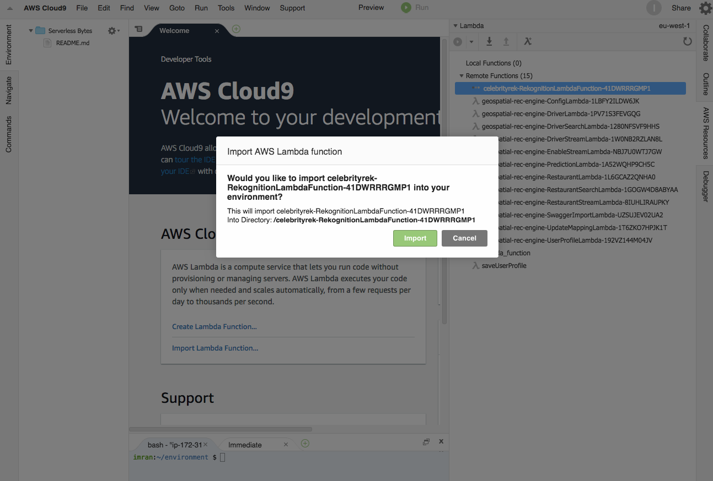

- Update lambda function [with this code](scripts/compareFaces.py) so it compares images from incoming tweets with the reference image. We will use Rekognition API to achieve face comparison. Review more details about the face comparison API at http://boto3.readthedocs.io/en/latest/reference/services/rekognition.html#Rekognition.Client.compare_faces

- Join us at Twitch to live edit this Lambda function and compare incoming images from tweets with the reference images.

## 11. Validate face comparison

- Log into your Twitter account in your mobile phone or browser.

- Create a new Tweet using a different image of your favorite celebrity that you used as reference image.

- In few seconds you should be notified about successful match.

## Clean up

- Once complete with the workshop you can delete the stack to clean up the environment and stop all services.

- You will first have to delete the two S3 buckets created for this lab. Go to the AWS S3 console and view the contents of each bucket, both starting with "twtrrekog". Select each bucket and select **Delete bucket**.

- Go to CloudFormation and delete the rekognition-workshop stack by placing a check mark by it and selecting the delete action. This will remove the resources created in the workshop.
